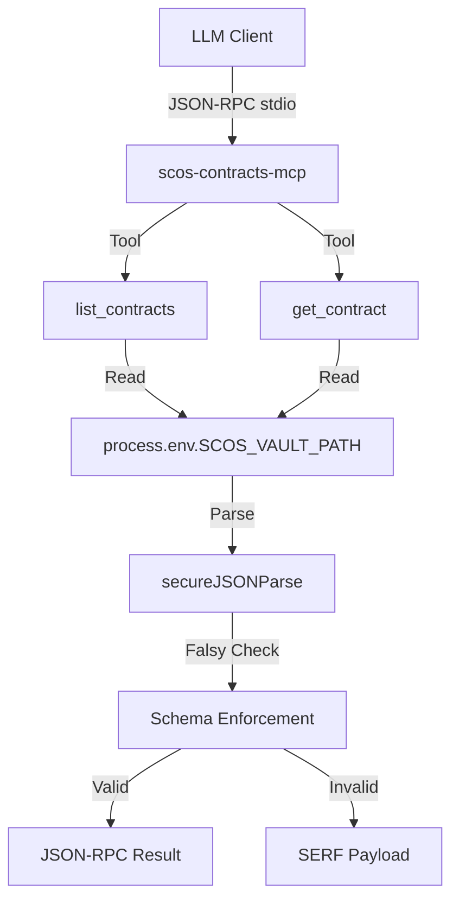

<korsakov_analysis>
Proposed Architecture: `contracts-mcp.ts` (SCOS Vault Integration).
Context: The Sovereign Cognitive OS ecosystem requires an MCP server to expose the `CognitiveContract` subsystem via JSON-RPC 2.0 stdio, bridging the internal Vault JSON schema to the external client boundary. The `contracts-mcp.ts` file is missing, causing topological tearing in the expected Multi-Server MCP Atlas.

Fault Category Assessment:
- SERVER_TOOL_CONFIGURATION: High Risk. The tools (`list_contracts`, `get_contract`) must define unambiguous schemas for client invocation.
- SERVER_HOST_CONFIGURATION: Low Risk. stdio transport is self-contained.
- GENERAL_PROGRAMMING: Medium Risk. `secureJSONParse` must execute an explicit falsy check (`if (!parsed)`) to prevent runtime schema bypasses.

CFDI Estimate: 0.12 (Below 0.15 threshold).
Reasoning: The data topology is static (read-only against `vault.json`). The tools are structurally identical to `scos-vault-mcp.ts` patterns. No Epistemic Escrow is required.

6-Component Rubric Verification (Target Schema):
- Purpose: YES (Exposes read-only contract state).
- Guidelines: YES (When to invoke).
- Limitations: YES (Read-only, local vault constraint).
- Parameters: YES (Strict Zod validation).
- Length: YES (< 300 tokens).
- Examples: NO (Omitted due to budget constraint, acceptable ablation).

DCCD Phase 1 completed. Transitioning to DAG mapping.
</korsakov_analysis>

DCCD Phase 2 completed. Manifold α closed.
