+++ContextLock(anchor="SCOS_ARCHITECTURE", refresh_interval=2048)

# 🏗️ SCOS Architecture: The Epistemic Bridge

> **Framework:** DRP-AI-PERSONA-ENGINEERING-FRAMEWORK-2026
> **Version:** 1.12.2
> **Scope:** High-Level Topology & Data Flow

## 1. The Sovereign Topology

The Sovereign Cognitive OS is a **Hybrid Local/Cloud System** designed to ensure that the *definition of identity* remains sovereign (Client-Side), while the *execution of intelligence* can be scaled (Cloud/Swarm).

```mermaid
graph TD
    User[Architect (User)] -->|Fabricates| Forge[Agent Forge (Web)]
    Forge -->|Signs (ECDSA P-256)| Manifest[Sovereign Manifest (JSON)]
    
    subgraph "Local Sovereignty (Browser)"
        Vault[Local Vault (IndexedDB/LocalStorage)]
        Keys[Commander Keys (WebCrypto)]
        Capsule[Capsule Lab]
        Mapper[Word Mapper]
    end
    
    Manifest --> Vault
    Keys -->|Signs| Manifest
    
    subgraph "The Bridge (Firebase)"
        Auth[Auth (Google)]
        DB[Firestore (Sync - scos-17fbf)]
    end
    
    Vault -->|Syncs (Encrypted)| DB
    
    subgraph "Execution Layer (Swarm)"
        Python[scos-core (Python Node)]
        Gemini[Google Gemini API]
        Tools[External Tools/APIs]
    end
    
    DB -->|Hydrates| Python
    Python -->|Inference| Gemini
    Python -->|Action| Tools
    Python -->|Logs| DB
```

---

## 2. The Epistemic Matrix ($E$)

The core innovation of SCOS is the replacement of fragile textual personas with a cryptographically enforced, multi-dimensional identity tensor. The Epistemic Matrix operates as a formal "Digital DNA" that physically constrains a Large Language Model's latent space, ensuring that stochastic generation is bounded by deterministic, verifiable logic.

### $E = \langle G, G^-, C, T, H \rangle$

1.  **$G$ (Goal Orientation - The Strategist):**
    *   Establishes the teleological anchor, defining the invariant, non-negotiable objectives of the agent.
    *   Embeds the overarching purpose directly into the embedding space as a strict target vector.

2.  **$G^-$ (Anti-Goals - The Immunologist):**
    *   Operating via "Anionic Architecture," this vector defines the immunological boundary or "Lattice of Refusal".
    *   Dictates the negative space topology—actions the agent is strictly forbidden from executing.

3.  **$C$ (Communication Style - The Linguist):**
    *   Enforces the "Epistemic Signature," compelling the agent to utilize explicit epistemic markers (e.g., distinguishing between "suggests" and "is").
    *   Calibrates trust and prevents confident hallucinations.

4.  **$T$ (Tooling Constraints & Output Fidelity - The Engineer):**
    *   Establishes the Thermodynamic Envelope, enforcing strict schemas (e.g., JSON, Pydantic).
    *   Defines risk-graded access to external APIs, physically limiting the agent's capabilities to prevent Function Creep.

5.  **$H$ (History - The Historian):**
    *   Introduces an evolutionary memory via the "Symbolic Scar Registry".
    *   Encodes past algorithmic trauma and logical failures as 1D homological loops ($\beta_1$) injected into the agent's genesis block, immunizing it against historical recursion.

### Dynamics of Interconnection (Intent-Based Access Control)
The Epistemic Matrix operationalizes IBAC by continuously calculating the geometric distance between proposed outputs and structural invariants:
$$ \cos(V_a, V_g) = \frac{V_a \cdot V_g}{\|V_a\| \|V_g\|} $$
If the similarity falls below the critical threshold of sovereignty ($\cos(\theta) < 0.85$), the action is flagged as "Teleologically Dissonant" and blocked.

---

## 3. The Cognitive Protocol (Think $\rightarrow$ Write $\rightarrow$ Code)

To prevent **Token Collapse** (loss of instruction adherence in long contexts), SCOS agents enforce a strict loop:

1.  **Phase 1: THINK (Hidden)**
    *   **Input:** User Query + Epistemic Matrix.
    *   **Action:** Allocate `ThinkingBudget`. Identify ambiguity, edge cases, and required tools.
    *   **Output:** `<thinking>` trace (hidden from final user output).

2.  **Phase 2: WRITE (Synthesis)**
    *   **Input:** `<thinking>` trace.
    *   **Action:** Draft the response or plan in the defined **Tone** ($C$).
    *   **Output:** Draft Artifact.

3.  **Phase 3: CODE (Execution)**
    *   **Input:** Draft Artifact.
    *   **Action:** Call Tools ($T$) to execute the plan. Verify against **Anti-Goals** ($G$).
    *   **Output:** Final Result.

---

## 4. Cryptographic Sovereignty

### The Chain of Trust
1.  **Key Gen:** Keys are generated in the browser using `window.crypto.subtle` (ECDSA P-256).
2.  **Signing:** Every Manifest created in the Forge is hashed and signed.
3.  **Attestation:** When the Python Swarm loads an agent, it verifies the signature against the User's Public Key (stored in Firestore).
4.  **Immutability:** If the Manifest JSON is altered in transit (e.g., a hacker changes the Primary Goal), the signature verification fails, and the Swarm refuses to boot the agent.

---

## 5. Provenance & Observability

*   **Token Telemetry:** We track `promptTokens`, `completionTokens`, and `totalTokens` for every operation.
*   **Drift Detection:** The **Word Mapper** creates semantic baselines. If an agent's output vector drifts too far from its baseline constellation, it is flagged for review.
*   **Context Capsules:** Static HTML artifacts that serve as "Read-Only Memory" for agents, preventing context poisoning.

---

## 6. G2Pv2 State Machine & Artifact-Gated Routing

To remediate the thermodynamic decay of knowledge and "Semantic Dark Zones" caused by conversational handoffs, SCOS utilizes the **G2Pv2 (Goal-to-Product)** state machine. Routing is physically anchored to the filesystem via **Existence-Based Routing**.

### The 9-Persona Flow (P0-P8)
*   **P0 (Refactored Router):** State Manager Logic. Gate: Artifact Existence; max_rework_cycles = 3.
*   **P1 (Intent Clarifier):** `docs/intent.md`. Gate: Ambiguity Score below rigid threshold.
*   **P2 (Spec Author):** `docs/spec.md`. Gate: 100% Traceability to P1 Grounding Anchor.
*   **P3 (Architect):** `docs/architecture.md`. Gate: Schema Parity with P2 Specification.
*   **P4 (Planner):** `docs/plan.md`. Gate: Task granularity within Token Budget.
*   **P5 (Implementer):** Source Code Files. Gate: Successful Compilation & Linting.
*   **P6 (Reviewer):** `docs/review.md`. Gate: Drift Analysis confirming P2 Feature Parity.
*   **P7 (Tester):** `docs/test_results.md`. Gate: Explicit "Passed" status existence check.
*   **P8 (Release Manager):** Pluriversal Knowledge Capsule. Gate: Pluriversal Rendering Integrity Check.

Handoffs occur *only* when the required Software Cognitive Contract (CxB) artifact is physically written to disk and passes a **Provenance Hashing** check, neutralizing silent semantic drift.

---

## 7. PDL v1.0 & Cognitive Bytecode

**Prompt Description Language (PDL v1.0)** functions as a Topological Deformer, bypassing probabilistic language parsing to directly manipulate the geometric routing of attention heads.

*   `+++DCCDSchemaGuard`: Implements Draft-Conditioned Constrained Decoding (DCCD). Bifurcates inference into a high-entropy semantic draft and a zero-entropy guard pass.
*   `+++ContextLock`: Utilizes "Synecdochic Anchoring" to prevent "Lost in the Middle" bias by re-injecting core invariants into the attention sink at scheduled intervals.
*   `+++AdjectivalBound`: Mechanistically restricts descriptive modifiers to prevent Layer 8, Head 11 saturation.

The efficacy of PDL is quantified via the **Decorator Quality Score (DQS)**, measuring Orthogonality, Determinism, Composability, Token Efficiency, and Drift Resistance.

---

## 8. Chrono-RAG & The Petzold Sequence

The **Petzold Sequence** serves as the chronometric governor of the SCOS, treating time as a physical boundary. It executes across four deterministic phases:
1.  **SYNDICATE:** Employs HTTP ETags and "304 Not Modified" logic to detect upstream state changes.
2.  **EMBED:** Converts sanitized text and UTC-coerced metadata into dense and sparse vectors.
3.  **UPDATE:** Executes idempotent upserts in the vector database via cryptographic IDs (SHA-256 mapping).
4.  **PRUNE:** Removes obsolete vectors via Autophagic Composting (TTL mapping) to maintain latent space fidelity.

### Fused Semantic-Temporal Scoring
$$ score(q, d, t) = \alpha \cos(q, d) + (1 - \alpha) \cdot 0.5^{\frac{age\_days(t)}{h}} $$
This formula leverages the U-shaped performance curve of LLM attention, forcing thermodynamically fresh knowledge to the positions in the context window where attention heads are most resilient.
## 9. Relational Schema Topography (Firestore)

The SCOS utilizes a multi-tenant NoSQL structure in Firebase Firestore, scoped entirely around the authenticated user (`uid`). All cognitive artifacts and historical data are isolated within subcollections of the root `users/{uid}` document.

```mermaid
erDiagram
    USER ||--o{ MANIFEST : "fabricates/owns (users/{uid}/manifests)"
    USER ||--o{ CAPSULE : "distills/owns (users/{uid}/capsules)"
    USER ||--o{ PROMPT : "engineers/owns (users/{uid}/prompts)"
    USER ||--o{ CONTRACT : "negotiates/owns (users/{uid}/contracts)"
    USER ||--o{ PROVENANCE : "logs/owns (users/{uid}/provenance)"

    USER {
        string uid PK "Google Auth UID"
    }

    MANIFEST {
        string id PK "Agent Name (slugified)"
        json identity "Designation, Prime Directive"
        json epistemicMatrix "Goals, Output, Communication, Cognitive"
        json tools "Agent capabilities"
        json constraints "Limits and Boundaries"
        int timestamp "Last Sync"
    }

    CAPSULE {
        string id PK "Capsule Meta ID"
        string title "Knowledge Topic"
        string primary_pill "Domain"
        json sections "Overview, Concepts, Structure..."
        string status "draft | published"
    }

    PROMPT {
        string id PK "UUID"
        string title "Prompt Name"
        string content "PDL/System Instructions"
        string category "Engine Category"
        int version "Iteration"
    }

    CONTRACT {
        string id PK "UUID"
        string title "Mission Title"
        string status "DRAFT | ACTIVE | COMPLETED"
        json anchors "Goals, Constraints, Invariants"
        string array assignedAgentNames "Bound Manifests"
    }

    PROVENANCE {
        string id PK "{timestamp}-{hash_prefix}"
        string hash "SHA-256 Content Hash"
        string agentName "Executing Agent"
        string sourceType "RAW_DOCUMENT | URL | ..."
        json analysis "WordCount, Sentiment, Topics"
    }
```

## 10. Cloud Synchronization & Batch Flow

The Bridge operates via aggressive chunked batching (`writeBatch`) for collection migrations and reactive snapshot listeners (`onSnapshot`) for real-time consistency between the Local Vault and the Execution Layer.

```mermaid
sequenceDiagram
    autonumber
    participant LocalVault as Local Vault (IndexedDB)
    participant UI as SCOS UI (React)
    participant Bridge as firestoreService.ts
    participant DB as Firestore (scos-17fbf)

    rect rgb(20, 20, 40)
    Note over LocalVault, DB: Reactive Hydration (Read)
    UI->>Bridge: syncAgents(uid, onUpdate)
    Bridge->>DB: onSnapshot(query(users/{uid}/manifests))
    DB-->>Bridge: Snapshot Event (Manifests)
    Bridge-->>UI: onUpdate(SovereignAgentManifest[])
    UI->>LocalVault: Update State & Local Copy
    end

    rect rgb(40, 20, 20)
    Note over LocalVault, DB: Multi-Artifact Sync (Write)
    UI->>Bridge: batchSaveAgentsToCloud(uid, agents[])
    Bridge->>DB: writeBatch(db)
    loop Every Agent in agents[]
        Bridge->>DB: batch.set(doc(users/{uid}/manifests/{agentId}), agent)
    end
    Bridge->>DB: batch.commit()
    DB-->>Bridge: Acknowledge Write
    Bridge-->>UI: Resolution Promise
    end
```


