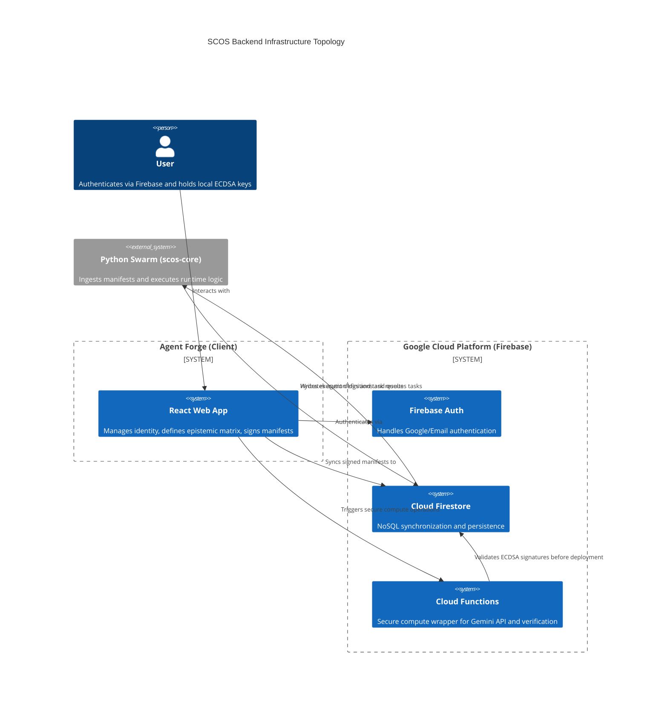
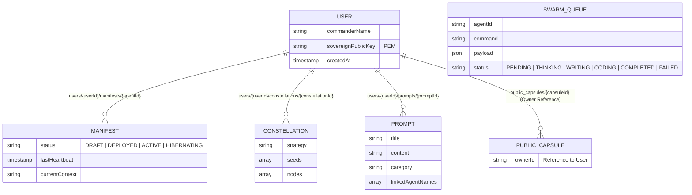

+++ContextLock(anchor="SCOS_BACKEND", refresh_interval=2048)

# SCOS Backend Architecture: Hybrid Sovereignty

> **Status:** Operational (v1.12.2)
> **Target Infrastructure:** Firebase (Google Cloud Platform - `scos-17fbf`)
> **Philosophy:** Cloud for Synchronization, Client for Sovereignty.

## 1. Core Philosophy: The Sovereign Bridge

The transition to a cloud backend **must not** compromise the "Sovereign" aspect of the OS.
- **Identity:** Users authenticate via Firebase (Google/Email) for *access*, but use local ECDSA keys for *attestation*.
- **Data:** Manifests are stored in Firestore for availability but are cryptographically signed on the client before upload.
- **Compute:** The "Forge" (Web) defines the intent (Epistemic Matrix); The "Swarm" (Python) executes the logic.

---

## 2. Infrastructure Components



### A. Authentication (Firebase Auth)
- **Primary:** Google Sign-In & Email/Password.
- **The Link:** Upon login, the client checks for a local `localStorage` Commander Key. If found, the Public Key is uploaded to the User Profile. This links the "Cloud Identity" to the "Sovereign Identity".

### B. Persistence (Cloud Firestore)
NoSQL Document structure designed for real-time syncing between the Web Forge and Python Swarm nodes.



**Schema Definitions:**

*   `users/{userId}`
    *   `commanderName`: string
    *   `sovereignPublicKey`: string (PEM)
    *   `createdAt`: timestamp

*   `users/{userId}/manifests/{agentId}`
    *   Contains the full `SovereignAgentManifest`.
    *   **New in v1.9:** Includes `epistemicMatrix` (Goals, Output, Communication, Cognitive).
    *   `status`: 'DRAFT' | 'DEPLOYED' | 'ACTIVE' | 'HIBERNATING'
    *   `lastHeartbeat`: timestamp (Updated by Python Swarm)
    *   `currentContext`: string (Real-time logs from Python)

*   `users/{userId}/constellations/{constellationId}`
    *   Contains the semantic graph generated by the Word Mapper.
    *   `strategy`: 'WORLDVIEW' | 'TRACER' | 'ANTI_PATTERN' etc.
    *   `seeds`: array of strings.
    *   `nodes`: array of `SemanticNode` objects.
    *   *Purpose:* Persistent storage for Worldview Ontologies and Drift Detection baselines.

*   `users/{userId}/prompts/{promptId}`
    *   **New in v1.9.6:** Contains `SovereignPrompt` definitions.
    *   `title`: string
    *   `content`: string
    *   `category`: string
    *   `linkedAgentNames`: array of strings

*   `public_capsules/{capsuleId}`
    *   Contains `ContextCapsule`.
    *   Readable by authenticated users (if published).
    *   Writeable only by owner.

*   `swarm_queue/{jobId}`
    *   `agentId`: string
    *   `command`: string
    *   `payload`: JSON
    *   `status`: 'PENDING' | 'THINKING' | 'WRITING' | 'CODING' | 'COMPLETED' | 'FAILED'
    *   *Purpose:* The Web App writes here; Python Swarm listens here.

### C. Secure Compute (Cloud Functions 2nd Gen)
Move the Gemini API calls from the client to the server to protect your `GEMINI_API_KEY` and enforce quotas.

*   `fabricateAgent(prompt: string)`: Secure wrapper for Gemini Pro.
*   `distillCapsule(context: string)`: Secure wrapper for Capsule generation.
*   `triangulateConcepts(seeds: string[], strategy: string)`: Secure wrapper for Word Mapper synthesis.
*   `verifySignature(payload: any)`: Server-side validation of the ECDSA-P256 signature using the stored public key before allowing deployment.

---

## 3. The Python Swarm Integration (`scos-core`)

The Python layer is the **Runtime Environment**. It does not *design* agents; it *ingests* manifests from the Forge and gives them life.

### Logic Flow
1.  **Boot:** Python script starts, authenticates with Firebase Admin SDK (Service Account).
2.  **Hydration:** Script listens to `users/{uid}/manifests`.
3.  **Instantiation:** When a manifest status changes to `DEPLOYED`:
    *   Python parses the JSON.
    *   **Attestation Check:** It validates the `provenance.signature` (ECDSA-P256-SHA256) against the user's uploaded Public Key to ensure the manifest has not been tampered with since leaving the client Forge.
    *   It reads the `epistemicMatrix.cognitive` settings to configure the runtime loop (Think/Write/Code).
    *   It dynamically loads Python functions that match the `tools` defined in the manifest.
4.  **Execution Loop:**
    *   Listens to `swarm_queue`.
    *   When a job arrives, passes context to the LLM (Gemini via Python SDK).
    *   Executes mapped Python tools.
    *   Writes results back to Firestore.

### Security Boundary
*   The Python Swarm runs in a **Docker Container**.
*   It has **READ** access to Manifests.
*   It has **WRITE** access to Logs and Queue Results.
*   It **CANNOT** modify the Agent Identity (Immutable).

---

## 4. Security Rules (`firestore.rules`)

**CRITICAL NOTE:** The Firebase project (`scos-17fbf`) is manually managed to preserve sovereign infrastructure. Automated rule deployment is strictly prohibited. The following rules must be manually applied in the Firebase Console:

```javascript
rules_version = '2';
service cloud.firestore {
  match /databases/{database}/documents {
    
    // Helper Functions
    function isAuthenticated() {
       return request.auth != null;
    }
    
    function isOwner(userId) {
       return isAuthenticated() && request.auth.uid == userId;
    }

    // User Sovereignty: Only you can touch your agents and constellations
    match /users/{userId} {
      allow read, write: if isOwner(userId);
      
      match /{document=**} {
        allow read, write: if isOwner(userId);
      }
    }
    
    // Swarm Nodes (Service Accounts) need specific access
    // This usually requires a custom claim or specific collection structure
    match /swarm_queue/{jobId} {
      allow read, write: if request.auth != null; // Refine for production
    }
  }
}
```
