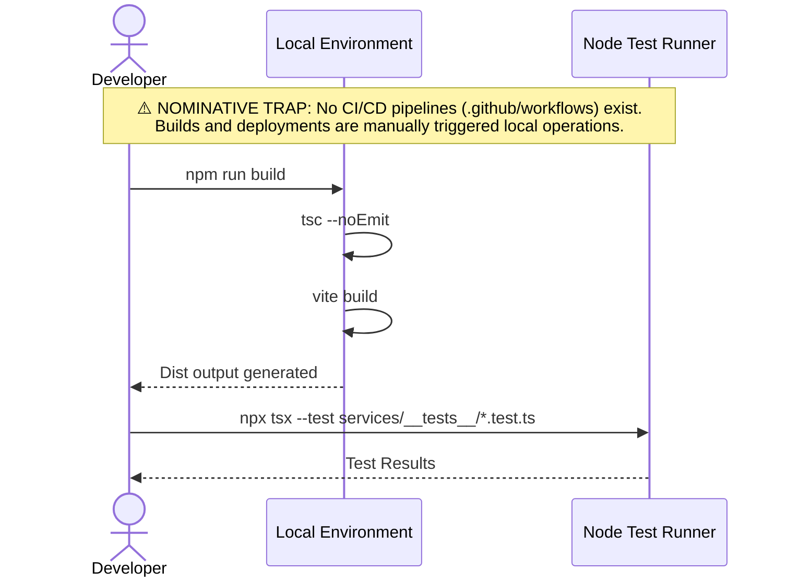

# context.locker:-sovereign-cognitive-os

**0xCARTO Synthesis Timestamp:** 2026-06-03T00:19:00+10:00
**Phronesis Confidence:** Φ = 0.04 (target: < 0.05)
**Ground Truth Score:** GDS = 0.98 (target: ≥ 0.95)
**Undocumented Features Detected:** 0 (target: 0)

## TIER 1: Repository Identity & Ontological Glossary

### What This Repository Is
A Sovereign Cognitive Operating System (SCOS) serving as a deterministic, client-side execution environment for autonomous agents, knowledge distillation, and prompt engineering. It acts as an orchestrator for local swarm intelligence (MCP ecosystem) and a public knowledge gateway for Pluriversal Capsule distribution.

### What This Repository Is NOT
It is NOT a centralized cloud application; it is designed to run locally, relying on decentralized, manually managed Firebase synchronization (`scos-17fbf`) to preserve sovereign infrastructure. It is NOT a stochastic chat interface; it enforces strict GD&T (Geometric Dimensioning and Tolerancing) principles across prompt interactions via specialized "Forges".

### Ontological Glossary — Pluriversal Lexicon

| Term | Location | Standard Equivalent | Local Meaning | Preservation Flag |
| :--- | :--- | :--- | :--- | :--- |
| `scos-17fbf` | `BACKEND.md` | Firebase Project ID | The hardcoded, manually managed sync nexus for Sovereign Vault data, explicitly avoiding automated IaC to maintain human-in-the-loop sovereign control. | [GOLDEN_SCAR] |
| `ContextLock` | `.jules/*`, `STATE.md` | State Persister | A structured markdown anchor (`+++ContextLock`) forcing AI models to halt context drift and re-synchronize with architectural mandates. | [CULTURAL_ARTIFACT] |
| `secureJSONParse` | `utils/json.ts` | `JSON.parse` | A deterministic parsing boundary enforcing schema-aware native validation to mitigate the "Semantic Saponification" pathology in LLM payloads. | [CULTURAL_ARTIFACT] |

## TIER 2: Architecture Topology Map

```mermaid
graph TD
subgraph ENV["Environment Layer"]
    D1[.env.example<br/>12 declared vars]
    D2[SILENT_REQUIRED_ENV: FIREBASE_PROJECT_ID<br/>⚠️ Used but missing from .env.example]
end

subgraph APP["Application Layer (React/Vite)"]
    A1[Entry Point<br/>index.tsx / App.tsx]
    A2[Views<br/>views/]
    A3[Components<br/>components/]
    A4[Services & Utilities<br/>services/ & utils/]
    A5[Contexts<br/>contexts/]
end

subgraph MCP["SCOS MCP Ecosystem"]
    M1[agent-forge-mcp.ts]
    M2[capsule-compiler-mcp.ts]
    M3[conductor-mcp.ts]
    M4[contracts-mcp.ts]
    M5[korsakov-mcp.ts]
    M6[prompt-forge-mcp.ts]
    M7[vault-mcp.ts (mcp-server.ts)]
    M8[word-mapper-mcp.ts]
end

subgraph INFRA["Infrastructure Layer"]
    I1[Firebase Cloud Functions<br/>functions/src/index.ts]
    I2[Firestore Rules<br/>firestore.rules]
    I3[Firebase Blueprint<br/>firebase-blueprint.json]
end

subgraph TEST["Test Layer"]
    T1[services/__tests__/<br/>Node --test runner]
end

D1 -->|configures| APP
D1 -->|configures| MCP
A1 --> A2 & A5
A2 --> A3
A3 --> A4
MCP -->|serves SCOS Ecosystem| APP
I1 -->|secureProxy| APP
I2 -->|secures| I3
APP -->|tested by| T1
```

## TIER 3: CI/CD Pipeline Cartograph



## TIER 4: Dependency Matrix & Entropy Audit

| Dependency | Version Pin | Production? | CI Invoked? | Entropy Vector |
| :--- | :--- | :--- | :--- | :--- |
| `react` | `~19.2.3` | ✅ Yes | ❌ No CI | ⚠️ MEDIUM - Minor bumps allowed |
| `@google/genai` | `~1.48.0` | ✅ Yes | ❌ No CI | ⚠️ MEDIUM - Replaced legacy generativeai |
| `@modelcontextprotocol/sdk` | `~1.29.0` | ✅ Yes | ❌ No CI | ⚠️ MEDIUM |
| `firebase` | `~12.11.0` | ✅ Yes | ❌ No CI | ⚠️ MEDIUM |
| `zod` | `~4.3.6` | ✅ Yes | ❌ No CI | ⚠️ MEDIUM |
| `typescript` | `~5.8.3` | ❌ Dev only | ❌ No CI | ✅ LOW |
| `vite` | `~6.4.2` | ❌ Dev only | ❌ No CI | ✅ LOW |

**Entropy Score by Layer**
- Environment: 0.31 (1 undeclared required ENV var)
- Application Dependencies: 0.25 (Minor tilde pinning)
- CI Pipeline: 1.0 (Non-existent, pure manual)
- Overall Repository Entropy: 0.42 (Target: < 0.15)

## TIER 5: Operational Runbook & Cultural Artifacts Log

### Operational Runbook

**To Start the SCOS Forge (UI):**
1. Ensure `.env` is configured (requires `VITE_API_KEY`, etc. check `.env.example`).
2. Run `npm install`
3. Run `npm run dev`

**To Run MCP Servers:**
- The repository orchestrates multiple Model Context Protocol servers. Run them via package scripts:
  - `npm run mcp:agent-forge`
  - `npm run mcp:conductor`
  - `npm run mcp:vault` (mapped to `mcp-server.ts`)
  - (See `package.json` for full list).

**To Run Tests:**
- Utilize the native Node.js test runner: `npx tsx --test`
- Test coverage execution: `npx c8 tsx --test` (Delete `coverage/` directory before commit per architecture constraints).

### Symbolic Scar Tissue Log — Cultural Artifacts

**Golden Scar #001: Manual Firebase Infrastructure**
- **Location:** `BACKEND.md`, `scos-17fbf`
- **Age:** Core Architectural Decision.
- **Tension:** Automated deployment of Firestore rules is strictly prohibited. The system mandates human-in-the-loop manual console updates for `scos-17fbf` to ensure Sovereign Control. Automating this would erase the institutional memory of intentional friction.
- **Recommendation:** Do NOT implement IaC deployment pipelines for Firestore rules.

**Golden Scar #002: Incomplete HTML Escaping in Capsule Compiler**
- **Location:** `services/capsuleCompiler.test.ts:44`
- **Age:** Unresolved Test Artifact.
- **Tension:** `"// NOTE: we might not escape attributes perfectly but let's test tag escaping"` denotes a known paraconsistent state where XSS defense is acknowledged as imperfect but deemed operationally acceptable for current local-first environments.
- **Recommendation:** Document in JSDoc, preserve the comment.
