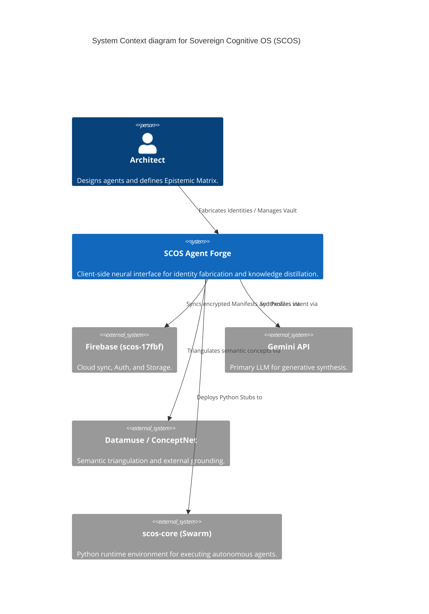
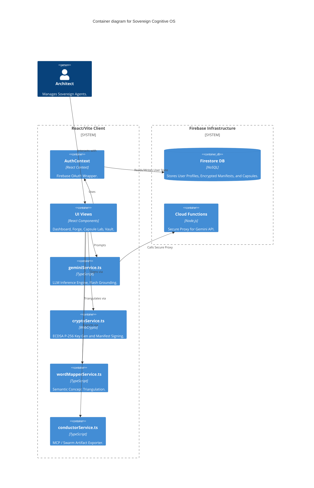
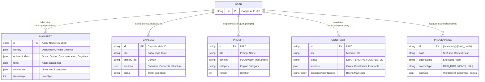

<!-- /// file: architecture.md /// -->
# SCOS 1.12.2 Architectural Topography

## 1. System Context (C4 Model)

## 2. Container Map (Meso-Scale)

## 3. Relational Schema Topography

## 4. Auth & Identity Provisioning Pipeline

```mermaid
sequenceDiagram
    autonumber
    actor User as Architect
    participant App as App.tsx / AuthContext
    participant Crypto as cryptoService.ts
    participant Firebase as Firebase Auth
    participant DB as Firestore (scos-17fbf)

    User->>App: Login via OAuth
    App->>Firebase: Authenticate()
    Firebase-->>App: UID & Token

    rect rgb(30, 30, 50)
    Note over App, Crypto: Key Generation
    App->>Crypto: generateCommanderKeys()
    Crypto->>Crypto: window.crypto.subtle.generateKey(ECDSA P-256)
    Crypto-->>App: CommanderKeyPair (Public/Private)
    end

    rect rgb(50, 30, 30)
    Note over App, DB: Profile Sync & Provisioning
    App->>DB: Upsert users/{uid}/profile (Public Key)
    DB-->>App: Acknowledge
    end

    App-->>User: Granted Access to Sovereign Forge
```

