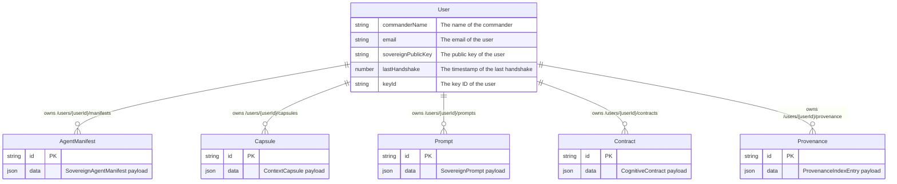
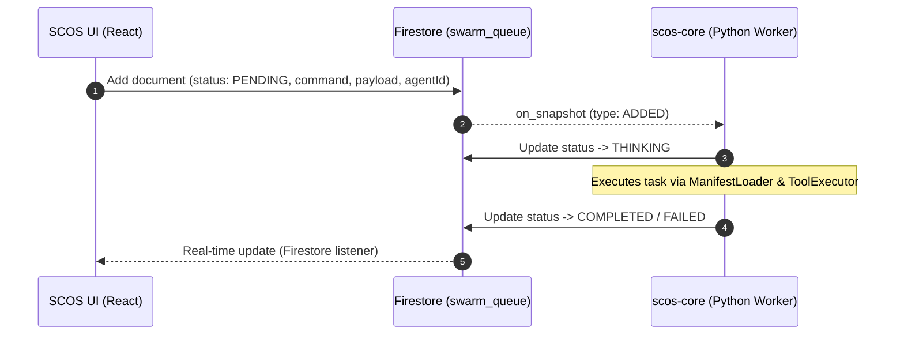

<!-- markdownlint-disable MD013 MD041 -->
# 🗺️ SCOS Data Model & Firestore Schema

> **Framework:** DRP-AI-PERSONA-ENGINEERING-FRAMEWORK-2026
> **Version:** 1.0.0
> **Scope:** Firestore Database Collections, Schemas, and Swarm Queues

## 1. Relational Schema Topography (Firestore)

This schema maps the NoSQL Firestore collections into an Entity-Relationship representation to visualize the physical data separation, nested subcollections, and cardinality of the Sovereign Cognitive OS (SCOS).

## 2. Swarm Task Queue Boundary

The SCOS system relies on a central `swarm_queue` collection at the root of the Firestore database to bridge the gap between the web client and the background Python execution nodes.

