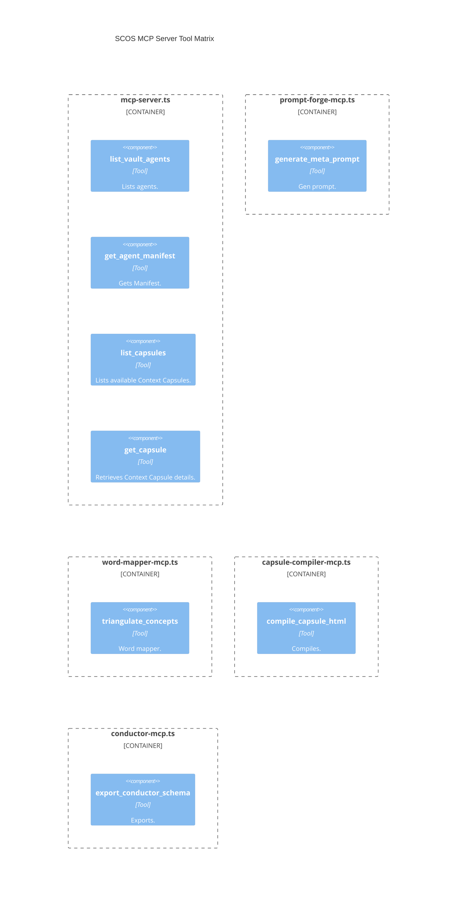

# 🗺️ SCOS MCP Ecosystem Atlas

> **Framework:** DRP-AI-PERSONA-ENGINEERING-FRAMEWORK-2026
> **Version:** 1.12.2
> **Scope:** Multi-Server Model Context Protocol (MCP) Boundaries

## 1. System Context: The Sovereign MCP Bridge

The SCOS Ecosystem relies on an array of standard MCP servers bridging
offline vault architectures with the external Swarm execution nodes,
translating SCOS Manifests to external protocol schemas via JSON-RPC stdio.

```mermaid
C4Context
  title SCOS MCP Integration Context
  Person(ai_client, "External AI Agent", "Consumes JSON-RPC APIs.")
  System_Boundary(scos_mcp_servers, "SCOS Node.js MCP Servers") {
    System(vault_mcp, "scos-vault-mcp", "Exposes local Vault artifacts.")
    System(conductor_mcp, "scos-conductor-mcp", "Orchestrates API tools/schemas.")
    System(prompt_forge_mcp, "scos-prompt-forge-mcp", "Generates high-fidelity meta-prompts.")
    System(word_mapper_mcp, "scos-word-mapper-mcp", "Performs semantic concept triangulation.")
    System(capsule_compiler_mcp, "scos-capsule-compiler-mcp", "Compiles HTML.")
  }
  System_Ext(gemini_api, "Google Gemini API", "LLM Generation endpoint.")
  System_Ext(concept_api, "ConceptNet / Datamuse", "External knowledge APIs.")
  Rel(ai_client, scos_mcp_servers, "Invokes Tools via Stdio Transport")
  Rel(prompt_forge_mcp, gemini_api, "Calls /v1/models/gemini-*")
  Rel(word_mapper_mcp, gemini_api, "Calls via secureProxy")
  Rel(word_mapper_mcp, concept_api, "Fetches associations")
```

## 2. Server Topography & Tool Capabilities



## 3. The Execution Flow: Prompt Forge Generation

```mermaid
sequenceDiagram
    autonumber
    participant Client as MCP Client (Stdio)
    participant ForgeMCP as prompt-forge-mcp.ts
    participant Zod as Zod Schema Validator
    participant GeminiSvc as geminiService.ts
    participant GeminiAPI as Gemini API

    Client->>ForgeMCP: JSON-RPC request (generate_meta_prompt)
    rect rgb(30, 30, 50)
    Note over ForgeMCP, Zod: Strict Parameter Validation
    ForgeMCP->>Zod: parse(intent, engine_type, meta_system_prompt, knowledge_context)
    alt Invalid Schema
        Zod-->>ForgeMCP: Throw ZodError
        ForgeMCP-->>Client: SERF Error Payload (TOOL_FAULT_GENERAL_PROGRAMMING)
    else Valid Schema
        Zod-->>ForgeMCP: Validated Parameters
    end
    end

    rect rgb(50, 30, 30)
    Note over ForgeMCP, GeminiAPI: Service Delegation & External Boundary
    ForgeMCP->>GeminiSvc: generateMetaPrompt(intent, engine_config)
    GeminiSvc->>GeminiAPI: Native fetch() with Retry Logic
    alt Rate Limit / Timeout
        GeminiAPI-->>GeminiSvc: 429 Too Many Requests
        GeminiSvc->>GeminiSvc: Exponential Backoff Retry
    end
    GeminiAPI-->>GeminiSvc: Generated Prompt Text
    GeminiSvc-->>ForgeMCP: Resolution Promise
    end

    ForgeMCP-->>Client: JSON-RPC Response (status: "EXECUTED", prompt)
```


