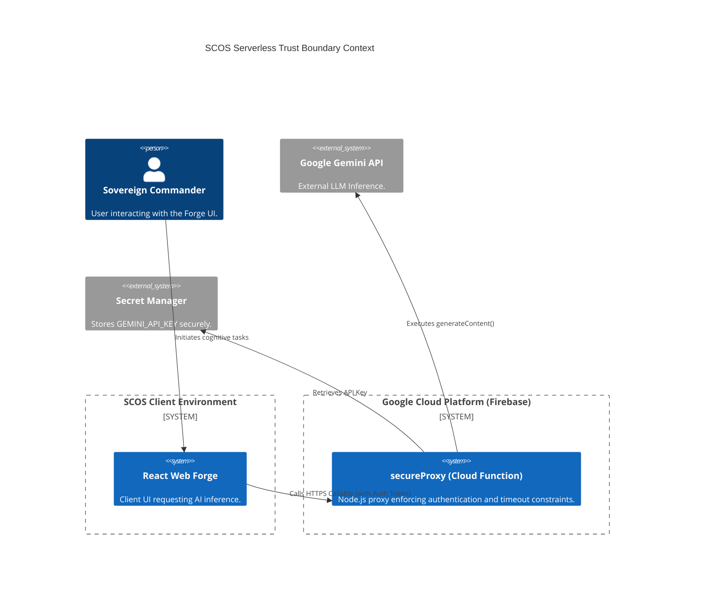

<!-- markdownlint-disable MD013 MD041 -->
# 🗺️ SCOS Serverless Trust Boundary

> **Framework:** DRP-AI-PERSONA-ENGINEERING-FRAMEWORK-2026
> **Version:** 1.0.0
> **Scope:** Firebase Cloud Functions (`secureProxy`) Trust Boundary

## 1. System Context: The Secure Proxy

The `secureProxy` Cloud Function serves as an anti-corruption layer and security boundary between the untrusted web client (React) and the external Gemini API. It encapsulates the `GEMINI_API_KEY` within the Google Cloud Secret Manager, preventing key exfiltration from the browser.

## 2. Serverless Execution Sequence

The `secureProxy` function enforces several invariants:

1. **Authentication:** Validates the presence of the `context.auth` token.
2. **Secret Injection:** Hydrates the `GEMINI_API_KEY` directly from the environment.
3. **Circuit Breaker (Timeout):** Implements a strict 15,000ms `AbortController` to prevent runaway LLM generation and unbounded execution costs.

```mermaid
sequenceDiagram
    autonumber
    participant Client as React Web App
    participant Func as secureProxy (Cloud Function)
    participant SecretManager as Secret Manager
    participant Gemini as Gemini API

    Client->>Func: Call (model, contents, config) + Auth Token

    rect rgb(30, 50, 30)
    Note over Func, SecretManager: Authentication & Secret Resolution
    alt Missing Auth Token
        Func-->>Client: HttpsError (unauthenticated)
    else Authenticated
        Func->>SecretManager: Resolve GEMINI_API_KEY
    end
    end

    alt Missing API Key
        Func-->>Client: HttpsError (internal)
    else Has API Key
        Func->>Func: Initialize GoogleGenAI
    end

    rect rgb(50, 30, 30)
    Note over Func, Gemini: Bounded Execution (15s Timeout)
    Func->>Func: Start AbortController (timeout: 15000ms)
    Func->>Gemini: models.generateContent(payload)
    alt Timeout Reached (>15s)
        Func->>Gemini: AbortSignal triggered
        Gemini-->>Func: AbortError
        Func-->>Client: HttpsError (internal)
    else Success (<15s)
        Gemini-->>Func: GenerateContentResponse
        Func->>Func: clearTimeout()
        Func-->>Client: Return { text, usage }
    end
    end
```

