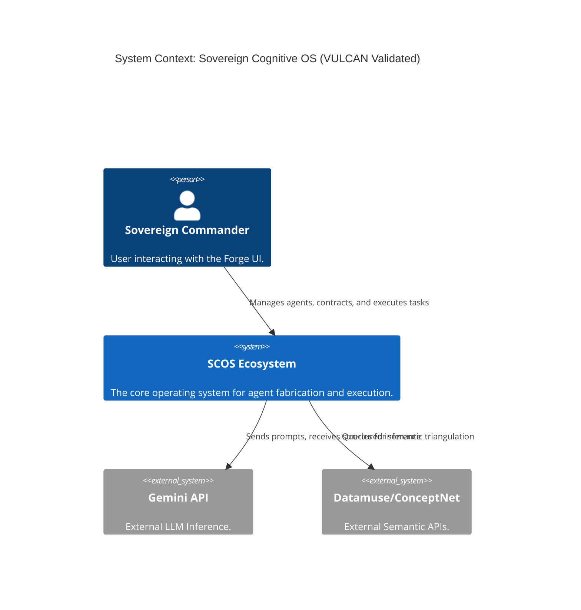
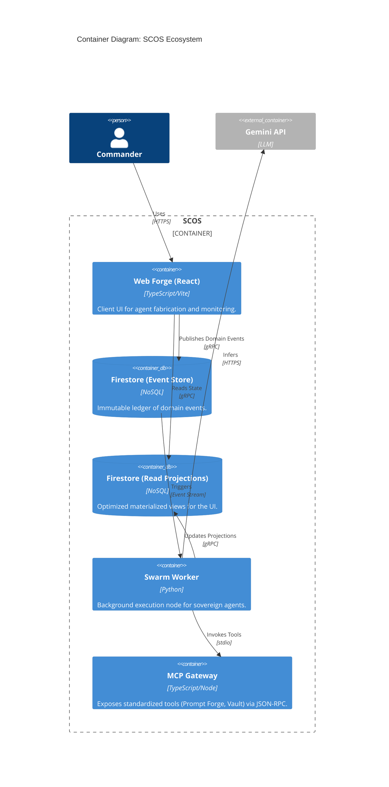
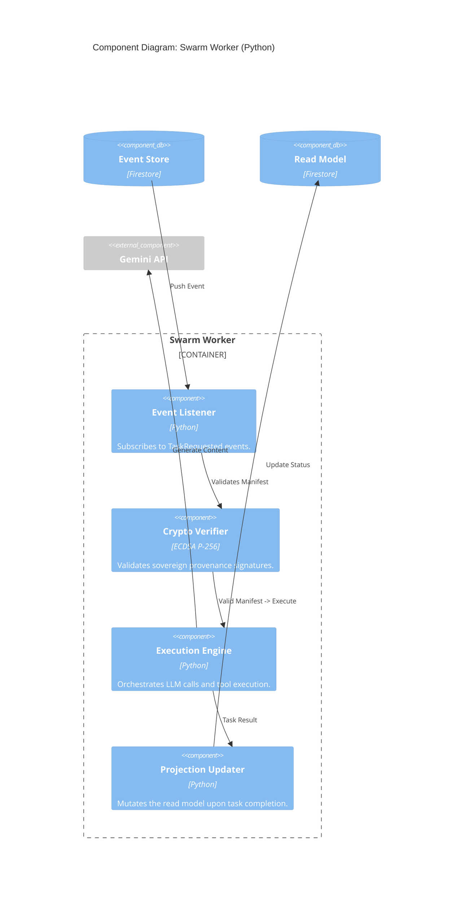

<!-- markdownlint-disable MD009 MD013 MD022 MD031 MD032 MD036 MD041 -->
# 🌋 VULCAN Topological Analysis & Architecture Blueprint

> **Persona:** VULCAN (The Brutalist)
> **Mission:** Topological Causal Sculpting & Eradication of Semantic Saponification
> **Scope:** SCOS Web Forge, Python Swarm Worker, and Firestore State boundaries.

---

## 1. Architecture Decision Record (ADR-VULCAN-001)

### Context
The current SCOS (Sovereign Cognitive Operating System) architecture permits both the React Web Forge (client) and the Python Swarm Worker (`scos-core`) direct read/write access to the shared Firestore database, specifically the `swarm_queue` and `users/manifests` collections. This violates the **Shared Database Anathema** (Rule 2) and introduces severe structural fragility. Permitting disparate operational domains (UI interaction vs. asynchronous LLM execution) to couple via physical schema tables leads to race conditions, untracked schema mutations, and transitivity fallacies.

### Decision
**Implement strict Event Sourcing / API-led Integration for Swarm Execution.**
The Web Forge will lose direct write access to the `swarm_queue` and will instead publish immutable `TaskRequested` domain events. The Swarm Worker will operate within a hardened, isolated bounded context, reacting to these events rather than listening to physical data mutations. The shared database must be conceptually bifurcated: the "Command" side handles state mutations via events, and the "Query" side handles read projections for the UI.

### Status
**Proposed / Mandated**

### Consequences
**Negative (Trade-offs / The Projection Tax):**
- **Increased Latency:** Moving from direct write to event-based async communication introduces artificial latency in the UI feedback loop.
- **Complexity Tax:** Implementing an event ledger and projection handlers requires additional infrastructure (e.g., dedicated Cloud Functions or Pub/Sub) compared to the simplistic `onSnapshot` Firestore listener currently in use.
- **Eventual Consistency Pain:** The UI must be engineered to handle optimistic updates and eventual consistency, discarding synchronous assumptions.

**Positive:**
- **Blast Radius Containment:** A failure or poison pill in the Swarm Worker will no longer corrupt the primary user manifest state.
- **Schema Autonomy:** The Python worker can evolve its internal execution schemas without breaking the React UI's expectations.
- **Auditability (Betti-1 Scars Avoided):** The system gains a deterministic audit log of every execution attempt, vital for sovereign provenance and debugging CAP theorem violations during network partitions.

### Mitigations
Implement a dead-letter queue (DLQ) for the event bus to handle persistent execution failures and enforce strict schema validation at the event boundary using Zod (TypeScript) and Pydantic (Python).

---

## 2. C4 Model Blueprint

### Level 1: System Context

### Level 2: Container

### Level 3: Component (Swarm Worker)

---

## 3. Domain-Driven Design (DDD) Context Map

| Context | Aggregate Root | Entities | Value Objects | Domain Events |
| :--- | :--- | :--- | :--- | :--- |
| **Identity & Fabricator** | `User` | `AgentManifest`, `Contract` | `SovereignPublicKey`, `BudgetConfig` | `AgentFabricated`, `ContractSigned` |
| **Swarm Execution** | `TaskExecution` | `ToolInvocation` | `TaskPayload`, `ExecutionResult` | `TaskRequested`, `TaskCompleted`, `TaskFailed` |
| **Semantic Map** | `Constellation` | `SemanticNode` | `ConceptEdge`, `TriangulationVector` | `ConceptMapped` |

### API / Event Contract Boundaries

**Upstream: Identity & Fabricator (Web Forge)**
- **Produces:** `TaskRequested` event.
- **Contract Strictness:** High. The Web Forge owns the definition of the task but relinquishes control over *how* it is executed.

**Downstream: Swarm Execution (Python Worker)**
- **Consumes:** `TaskRequested` event.
- **Produces:** `TaskCompleted` or `TaskFailed` events (which update the Read Projections).
- **Contract Strictness:** High. Must mathematically verify the provenance signature attached to the task before execution. It acts as an autonomous anti-corruption layer (ACL) protecting the execution environment from malformed client intents.

---
*End of Blueprint. Vulcan out.*
